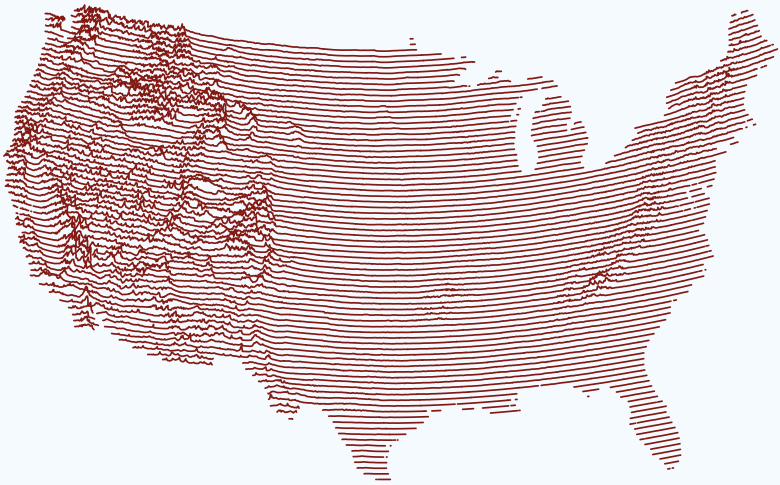

```{r, include=FALSE}
knitr::opts_chunk$set(
  results='asis', 
  echo = FALSE
)
library(tidyverse)
library(glue)

# Set this to true to have links turned into footnotes at the end of the document
PDF_EXPORT <- TRUE

# Holds all the links that were inserted for placement at the end
links <- c()

source('parsing_functions.R')


# First let's get the data, filtering to only the items tagged as
# Resume items
position_data <- read_csv('positions.csv') %>% 
  filter(in_resume)
  
```


Aside
================================================================================




Contact {#contact}
--------------------------------------------------------------------------------

- <i class="fa fa-envelope"></i> ryan.rosenberg@outlook.com
- <i class="fa fa-twitter"></i> rosenbergry
- <i class="fa fa-github"></i> github.com/ryanrosenberg
- <i class="fa fa-phone"></i> (914) 588-3813


Language Skills {#skills}
--------------------------------------------------------------------------------


```{r}
skills <- tribble(
  ~skill,               ~level,
  "R",                  5,
  "Civis Platform",     5,
  "SQL",                4,
  "Tableau",            4,
  "Python",             3,
  "Git",                3,
  "JavaScript",         2,
)

ggplot(skills, aes(reorder(skill, level), level)) +
  geom_col(fill = '#929292') +
  geom_text(aes(skill, 0.1, label = skill), 
            hjust = 0, family = 'IBM Plex Sans', color = 'white', size = 8) +
  scale_y_continuous(breaks = 1:5,
                     labels = c("Beginner", "Basic", "Functional",
                                "Advanced", "Expert")) +
  coord_flip() +
  theme(text = element_text(family = 'IBM Plex Sans'),
        plot.background = element_rect(fill = '#F7FBFF'),
        panel.background = element_rect(fill = '#F7FBFF'),
        panel.grid = element_blank(),
        panel.grid.major.x = element_line(color = '#202020', 
                                          linetype = 'dashed'),
        axis.line = element_blank(),
        axis.text.y = element_blank(),
        axis.text.x = element_text(size = 18),
        axis.title = element_blank(),
        axis.ticks = element_blank())
# 
# ggsave(p, "skill-graph.png")

```

<!--  -->

Hobbies {#experience}
--------------------------------------------------------------------------------

### Quizbowl

- Buzzer competition testing knowledge in a range of academic subjects
- Directed national tournaments at high school and college levels
- Developed widely-used statistic for measuring player and team strength

### Data Visualization

- I frequently make data visualizations for personal projects, e.g. testing out a new R package or analyzing quizbowl statistics
- Created transect map at top right with QGIS and R, from [Tom White's original maps](https://cartographicperspectives.org/index.php/journal/article/view/1536/1726).


Disclaimer {#disclaimer}
--------------------------------------------------------------------------------

Made w/ [**pagedown**](https://github.com/rstudio/pagedown). 

Source code: [github.com/ryanrosenberg/cv](https://github.com/ryanrosenberg/cv).


Main
================================================================================

Ryan Rosenberg {#title}
--------------------------------------------------------------------------------

```{r}
intro_text <- "I am a versatile data scientist, with experience in web panel surveys, data pipelining, predictive modeling, and data visualization and reporting.

Moving to Palo Alto in March and looking for positions in the Bay Area or remote."


cat(sanitize_links(intro_text))
```


Work Experience {data-icon=suitcase}
--------------------------------------------------------------------------------

```{r}
position_data %>% print_section('work')
```


Education {data-icon=graduation-cap data-concise=true}
--------------------------------------------------------------------------------

```{r}
position_data %>% print_section('education')
```


